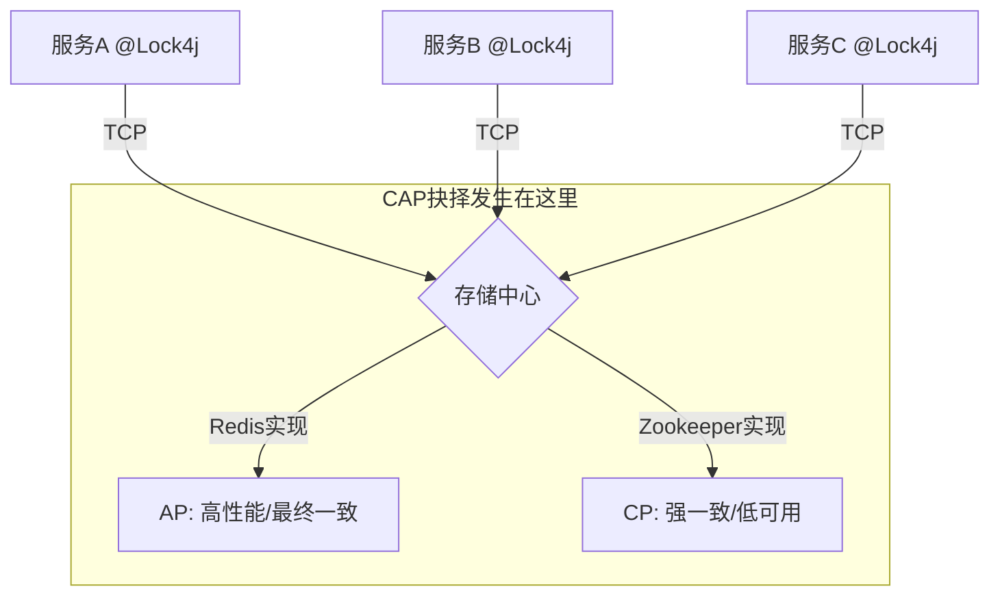

# `**@Lock4j**`** 方法级分布式锁注解**


Lock4j 「注解属性 → key 生成规则 → 典型用法 → 底层大致流程」来解析这份 `@Lock4j` 源码。

---

## **1. 整体作用**
`**@Lock4j**`** 是一个****方法级分布式锁注解****，基于 Spring AOP 实现。标注在方法上后，调用方法时会：**

1. **先根据 **`**name**`** + **`**keys**`**（SpEL）生成锁 key；**
2. **通过 **`**executor**`**（Redis / Redisson / Zookeeper 等）尝试获取锁；**
3. **获取成功 → 执行方法；失败 → 根据 **`**failStrategy**`** 处理；**
4. **方法执行完（包括抛异常）后，根据 **`**autoRelease**`** 决定是否自动释放锁，或等 **`**expire**`** 到期自动释放。**

---

## **2. 注解元信息**
```java
@Target(value = {ElementType.METHOD})
@Retention(value = RetentionPolicy.RUNTIME)
@Inherited
@Documented
public @interface Lock4j {
    ...
}
```

+ `**@Target(ElementType.METHOD)**`**：只能加在****方法****上。**
+ `**@Retention(RUNTIME)**`**：运行时保留，AOP 通过反射读取。**
+ `**@Inherited**`**：对类继承有效（实际使用中主要看方法是否被代理）。**
+ `**@Documented**`**：生成 javadoc 时会显示该注解。**

---

## **3. 属性逐条解析**
### **3.1 **`**name**`**：锁资源名称（前缀）**
```java
String name() default "";
```

+ **作用：作为锁 key 的****固定前缀****，用于区分业务模块或资源类型。**
+ **为空时：默认会使用 **`**包名+类名+方法名**`** 作为前缀（由 **`**DefaultLockKeyBuilder**`** 实现）。**
+ **典型用法：**

```java
@Lock4j(name = "order:")
public void processOrder(...) { }
```

---

### **3.2 **`**executor**`**：锁执行器类型**
```java
Class<? extends LockExecutor> executor() default LockExecutor.class;
```

+ **指定底层锁实现：RedisTemplate、Redisson、Zookeeper 等。**
+ **默认 **`**LockExecutor.class**`**：由 Spring Boot Starter 根据依赖自动选择（优先级通常为 Redisson > RedisTemplate > Zookeeper）。**
+ **一般情况下****不用管****，只有在多实现混用时，需要方法级强制指定某个 **`**executor**`**。**

---

### **3.3 **`**keys**`**：动态 key 部分（SpEL）**
```java
String[] keys() default "";
```

+ **支持 ****SpEL 表达式****，用于从方法参数中取值，组成动态 key。**
+ **最终锁 key 的构成逻辑（默认 **`**DefaultLockKeyBuilder**`**）：**
    - **前缀：**`**lock4j:**`**（可全局配置） + **`**name**`
    - **中间：**`**包名+类名+方法名**`**（如果 **`**name**`** 为空）**
    - **后缀：**`**keys**`** 中每个表达式解析后拼接**
+ **示例：**

```java
@Lock4j(name = "order:",
        keys = {"#userId", "#orderId"},
        expire = 30000)
public void processOrder(Long userId, String orderId) { }
```

**可能生成类似 key：****  
**`**lock4j:order:com.example.OrderService:processOrder:123:ORD001**`

> **注意：**`**keys**`** 是数组，可以写多个 SpEL，会按顺序拼到 key 后面。**
>

---

### **3.4 **`**expire**`**：锁过期时间（防死锁）**
```java
long expire() default -1;
```

+ **单位：毫秒。**
+ **含义：锁自动释放时间，用于防止服务宕机导致死锁。**
+ **默认值：**`**-1**`** 表示“使用全局配置”，即 **`**Lock4jProperties.expire**`**，默认 ****30 秒****。**
+ **建议：略大于业务方法的最大耗时，但不要设得特别长，避免异常情况下锁迟迟不释放。**

---

### **3.5 **`**acquireTimeout**`**：获取锁等待时间**
```java
long acquireTimeout() default -1;
```

+ **单位：毫秒。**
+ **含义：尝试获取锁的等待时间，超过时间则抛出 **`**LockFailureException**`**（默认失败策略）。**
+ **默认值：**`**-1**`** 表示“使用全局配置”，即 **`**Lock4jProperties.acquireTimeout**`**，默认 ****3 秒****。**
+ `**acquireTimeout = 0**`**：立即失败，不排队。**
+ `**acquireTimeout > 0**`**：会自旋重试，直到获取锁或超时。**

---

### **3.6 **`**autoRelease**`**：是否自动释放锁**
```java
boolean autoRelease() default true;
```

+ `**true**`**（默认）：**
    - **方法执行完毕（包括抛异常）后，在 finally 中释放锁。**
+ `**false**`**：**
    - **不会在方法结束后立即释放锁****，而是等 **`**expire**`** 到期自动释放。**
+ **典型用途：****限流 / 熔断场景****，例如：“用户在 5 秒内只能调用一次”。  
****示例（来自官方文档）：**

```java
// 5 秒内对同一 userId 只能调用一次
@Lock4j(keys = "#userId",
        acquireTimeout = 0,
        expire = 5000,
        autoRelease = false)
public String accessLimit(String userId) {
    // 若 5 秒内重复请求，直接抢锁失败
    return "ok";
}
```

---

### **3.7 **`**failStrategy**`**：获取锁失败策略**
```java
Class<? extends LockFailureStrategy> failStrategy() default LockFailureStrategy.class;
```

+ **获取锁失败时的处理策略。**
+ **默认 **`**LockFailureStrategy.class**`**：使用全局配置的 **`**DefaultLockFailureStrategy**`**，通常抛 **`**LockFailureException**`**。**
+ **可以自定义策略，例如：**
    - **抛出自定义业务异常；**
    - **返回特定错误码；**
    - **降级走其他逻辑（如查询缓存）。**

---

### **3.8 **`**keyBuilderStrategy**`**：Key 生成策略**
```java
Class<? extends LockKeyBuilder> keyBuilderStrategy() default LockKeyBuilder.class;
```

+ **决定如何把 **`**name**`** + **`**keys**`** 解析成最终的锁 key。**
+ **默认 **`**LockKeyBuilder.class**`**：使用 **`**DefaultLockKeyBuilder**`**，逻辑大致是：**
    - **前缀：**`**lock4j:**`** + **`**name**`**（或类名方法名）；**
    - **解析 **`**keys**`** 中的 SpEL；**
    - **用分隔符（如 **`**:**`**）拼接各部分。**
+ **可自定义实现，比如：**
    - **对 key 做脱敏、哈希；**
    - **组合多个维度参数（用户+业务类型+时间片）等。**

---

## **4. Key 生成 & 执行流程示意**
**用一个简单的流程图概括一下执行过程：**


---

## **5. 典型使用示例**
### **5.1 最简单用法（全部用默认值）**
```java
@Service
public class OrderService {
    // 使用全局默认：acquireTimeout=3s, expire=30s, autoRelease=true
    // name 为空，默认用 "包名+类名+方法名" 作为前缀
    @Lock4j
    public void createOrder(Order order) {
        // 业务逻辑
    }
}
```

---

### **5.2 指定 key + 过期时间 + 等待时间**
```java
@Lock4j(name = "order:",
        keys = "#orderId",
        expire = 60000,        // 60s
        acquireTimeout = 5000) // 最多等 5s
public void processOrder(String orderId) {
    // 业务逻辑
}
```

---

### **5.3 限流：用户 X 秒内只能访问一次**
```java
// 5 秒内同一用户只能访问一次
@Lock4j(keys = "#userId",
        acquireTimeout = 0,
        expire = 5000,
        autoRelease = false)
public String limit(String userId) {
    // 如果 5 秒内重复请求，抢锁失败直接抛异常或走失败策略
    return "ok";
}
```

---

### **5.4 自定义失败策略 + Key 生成器（高级）**
```java
@Lock4j(name = "payment:",
        keys = {"#request.userId", "#request.channel"},
        expire = 30000,
        acquireTimeout = 3000,
        failStrategy = SmartLockFailureStrategy.class,
        keyBuilderStrategy = PaymentLockKeyBuilder.class)
public PayResult pay(PayRequest request) {
    // 业务逻辑
}
```

+ `**PaymentLockKeyBuilder**`**：按自己的规则拼接 key（例如加业务前缀、脱敏等）。**
+ `**SmartLockFailureStrategy**`**：获取锁失败时，可以降级走队列、返回特定状态码等。**

---

## **6. 和全局配置的关系（Lock4jProperties）**
`**@Lock4j**`** 的 **`**expire**`** 和 **`**acquireTimeout**`** 默认值都是 **`**-1**`**，表示“使用全局配置”。典型 YAML 配置：**

```yaml
lock4j:
  acquire-timeout: 3000   # 默认 3s
  expire: 30000           # 默认 30s
  primary-executor: com.baomidou.lock.executor.RedissonLockExecutor
  lock-key-prefix: lock4j
```

+ **若方法上写 **`**@Lock4j(expire = 60000)**`**，则该方法的锁过期时间为 60 秒。**
+ **若不写，则走全局 **`**lock4j.expire**`**。**

---

## **7. 小结**
+ `**@Lock4j**`** 的核心思想：通过 AOP + 注解，把分布式锁的“获取锁、业务执行、释放锁”模板化。**
+ **关键参数：**
    - `**name**`** + **`**keys**`**：决定锁的粒度和 key；**
    - `**expire**`**：防止死锁；**
    - `**acquireTimeout**`**：控制排队时间；**
    - `**autoRelease**`**：决定是否立即释放锁（限流场景设为 **`**false**`**）。**
+ `**executor**`**、**`**failStrategy**`**、**`**keyBuilderStrategy**`** 提供了底层实现、失败策略、key 生成策略的扩展点。  
****如果你后续想深入某一块，比如“如何自定义 LockKeyBuilder / LockFailureStrategy”或“RedisTemplate 与 Redisson 执行器的区别”，可以再单独展开。**

# ** Lock4j 如何实现 CAP 的“三选二”**
**Lock4j 自身不具备“跨服务”的能力，它只是一个“遥控器”。真正的 CAP 取舍发生在 Lock4j 背后的存储中间件（如 Redis、Zookeeper、数据库）中。**  
以下是详细解析：

### 1. 核心误区：注解是“遥控器”，不是“锁本体”
你认为“Lock4j 没有跨越服务的能力”，这是完全正确的。`@Lock4j` 注解仅仅是一个**标记**，真正的锁逻辑发生在 Spring AOP 切面中，而切面所执行的 `LockExecutor`（锁执行器）需要连接外部的**第三方存储中心**。  
**跨服务的能力并不是由 Lock4j 提供的，而是由底层依赖的中间件提供的。**

+ **Lock4j 的角色**：它是一个标准化的 API 层。它屏蔽了底层 Redis、Zookeeper 等不同的操作细节，让开发者像调用本地方法一样调用分布式锁。
+ **CAP 的承担者**：真正决定 CAP 取舍的，是 Lock4j 配置的底层存储。

### 2. Lock4j 如何实现 CAP 的“三选二”？
CAP 定理（Consistency 一致性、Availability 可用性、Partition tolerance 分区容错性）针对的是**分布式数据存储系统**。Lock4j 通过适配不同的 `LockExecutor`（执行器），让你选择了不同的 CAP 策略：

#### 情况 A：选择 Redis 作为底层（通常选择 AP 或最终一致的 CP）
如果你的项目引入了 Redis 依赖，Lock4j 默认使用 `RedisTemplateLockExecutor`。

+ **架构**：多个微服务实例通过网络连接到 Redis 节点。
+ **CAP 取舍**：
    - **Partition Tolerance (P)**：网络是物理属性，必须有 P。
    - **Availability (A)**：Redis 追求高性能和可用性。
    - **Consistency (C)**：**这里是权衡点。**
        * **主从架构 Redis**：由于异步复制，Master 宕机时可能丢锁，这是牺牲了强一致性（C）来换取高可用（A）。这是典型的 **AP** 场景。
        * **RedLock 算法**：Lock4j 支持 Redisson 的 RedLock，通过多个独立 Redis 节点同时加锁，试图在 AP 架构上追求 CP（强一致性），但会牺牲性能和部分可用性。

**结论**：使用 Lock4j + Redis，本质上是**借用 Redis 的 AP 特性来实现分布式锁**。虽然不是强一致性，但在绝大多数业务场景下（如防止重复下单），最终一致性已经足够。

#### 情况 B：选择 Zookeeper 作为底层（典型 CP）
如果你的项目引入了 Zookeeper 依赖，Lock4j 会使用 `ZookeeperLockExecutor`。

+ **架构**：微服务连接 ZK 集群。
+ **CAP 取舍**：
    - **Partition Tolerance (P)**：有。
    - **Consistency (C)**：ZK 依赖 ZAB 协议，保证数据强一致。只要锁加成功，所有节点看到的状态一致。
    - **Availability (A)**：如果 ZK 集群挂掉超过半数节点，服务将不可用。**这是牺牲了可用性（A）来换取强一致性（C）。**  
**结论**：使用 Lock4j + Zookeeper，本质上是**借用 ZK 的 CP 特性**。适合对数据一致性要求极高（如金融转账、库存绝对不能超卖）的场景，容忍性能损耗和潜在的不可用风险。

### 3. 为什么 Lock4j 看起来“没有跨服务能力”？
Lock4j 通过**共享存储** 模式实现了跨服务协调。  
虽然 Lock4j 代码运行在各个微服务进程内部，看似隔离，但它们都通过 TCP 协议连接到了同一个中心节点。



Lock4j 的 `executor` 属性就是让你切换 CAP 策略的开关：

```java
// 源码中的这一行，决定了 CAP 的取舍方向
Class<? extends LockExecutor> executor() default LockExecutor.class;
```

### 4. 总结
Lock4j 并没有颠覆 CAP 理论，它只是一个**适配器**：

1. 它**没有**跨越服务的能力，它依赖底层的 Redis 或 Zookeeper 提供跨越服务的能力。
2. **CAP 的选择题不是 Lock4j 做的，是开发者在引入中间件依赖时做的**：
    - 你引入了 `lock4j-redis-template-spring-boot-starter`，你就选择了 **AP**（偏向高可用、高性能、允许极小概率的不一致）。
    - 你引入了 `lock4j-zookeeper-spring-boot-starter`，你就选择了 **CP**（偏向强一致、牺牲性能和部分可用性）。  
Lock4j 的价值在于：**它把复杂的 CAP 权衡和底层实现细节，封装成了一个简单的注解，让你不需要关心底层是 Redis 还是 ZK，只需要关心业务逻辑。**

# `LockExecutor`（锁执行器）
选择合适的 `LockExecutor`（锁执行器）是平衡系统**性能**、**可靠性**和**一致性**的关键。  
Lock4j 默认支持多种执行器，选择逻辑主要取决于你的**业务场景对 CAP 理论的取舍**以及**现有的技术栈基础设施**。  
以下是详细的选型指南：

### 1. 决策流程图
在决定使用哪种执行器之前，先问自己三个问题：

1. **业务对一致性要求有多高？**（是绝对不能出错，还是可以容忍亿万分之一的概率出错？）
2. **锁的持有时间有多长？**（是几毫秒的并发控制，还是几分钟的定时任务？）
3. **现有环境中有什么中间件？**（已经有 Redis 还是需要引入新的 ZK？）

---

### 2. 主流执行器对比详解
#### A. RedisTemplateLockExecutor (基于 Redis)
这是最常用的执行器，也是 Spring Boot 环境下的默认选择。

+ **底层原理**：利用 Redis 的 `SETNX` (Set if Not Exists) 原子指令。
+ **CAP 取舍**：**AP (可用性优先)**。
    - Redis 追求高性能和可用性，主从异步复制可能导致锁在故障切换时丢失（极小概率）。
+ **适用场景**：
    - **高并发抢购/秒杀**：性能极高，能抗住巨大流量。
    - **防重复提交**：前端防止按钮重复点击。
    - **普通业务锁**：如订单状态流转，允许极小概率的锁失效（可通过数据库乐观锁兜底）。
+ **优点**：性能最强，接入成本最低（大多数项目都有 Redis）。
+ **缺点**：不是强一致性，Master 宕机未同步数据时可能丢锁；没有看门狗机制（不能自动续期），需要合理设置 `expire`。

#### B. RedissonLockExecutor (基于 Redisson)
这是**推荐的生产环境高级选择**。Redisson 是一个驻留在内存里的分布式 Java 对象和服务框架。

+ **底层原理**：基于 Redis，但在客户端实现了复杂的分布式锁逻辑（如 Hash 结构存储锁、Pub/Sub 通知解锁）。
+ **核心优势（看门狗机制）**：
    - 它解决了 `RedisTemplate` 的痛点。如果你不设置 `expire`，Redisson 会启动一个后台线程（Watchdog），每隔一段时间自动给锁续期。
    - 这对于**耗时不确定的任务**非常关键，避免了任务没执行完锁就过期，或者死锁的问题。
+ **适用场景**：
    - **长耗时任务**：如生成大型报表、批量数据同步，不知道确切执行时间。
    - **需要高可靠性的业务**：Redisson 实现了更完善的锁机制，比原生 RedisTemplate 更健壮。
+ **优点**：支持自动续期、可重入锁、读写锁、红锁；性能依然优秀。
+ **缺点**：引入了 Redisson 依赖（比较重），相对于原生 RedisTemplate 稍微复杂一点。

#### C. ZookeeperLockExecutor (基于 Zookeeper)
这是强一致性的代表。

+ **底层原理**：利用 ZK 的临时顺序节点和 Watch 机制。
+ **CAP 取舍**：**CP (一致性优先)**。
    - ZK 遵循 ZAB 协议，保证数据强一致。只要锁加成功，集群状态一定一致。
+ **适用场景**：
    - **金融核心系统**：转账、核心账务变更，绝对不允许锁失效导致数据不一致。
    - **配置中心/选主**：利用 ZK 的特性做 Master 选举。
+ **优点**：强一致性，可靠性极高；客户端断开连接时锁会自动释放（解决死锁）。
+ **缺点**：**性能最差**（每次加锁都要集群投票协商）；需要额外维护 ZK 集群；网络波动容易导致锁频繁释放（羊群效应，虽然新版本有优化，但问题仍存在）。

#### D. JdbcLockExecutor (基于数据库)
这是“保底”方案或“轻量级”方案。

+ **底层原理**：数据库唯一索引约束 (`INSERT`) 或行锁 (`SELECT FOR UPDATE`)。
+ **适用场景**：
    - **存量老项目**：没有 Redis/ZK，不想引入新组件。
    - **低并发定时任务**：防止多实例重复跑任务。
+ **优点**：简单，无额外依赖，利用现有数据库。
+ **缺点**：性能差，锁表压力大，不支持锁续期，容易死锁，不适合高并发。

---

### 3. 选型总结表
| 维度 | RedisTemplate | Redisson (推荐) | Zookeeper | JDBC |
| :--- | :--- | :--- | :--- | :--- |
| **性能** | ⭐⭐⭐⭐⭐ (极高) | ⭐⭐⭐⭐ (高) | ⭐⭐ (中低) | ⭐ (低) |
| **一致性** | 弱 (AP) | 弱 (AP，但更安全) | **强 (CP)** | 强 (CP) |
| **可靠性** | 中 (有丢锁风险) | 高 (有看门狗) | 极高 | 中 (依赖DB) |
| **自动续期** | 否 (需手动设超时) | **是 (看门狗)** | 否 (临时节点) | 否 |
| **依赖要求** | Redis | Redis + Redisson | Zookeeper | 关系型数据库 |
| **典型场景** | 秒杀、防重 | 长任务、核心业务 | 金融核心、选主 | 简单任务、老项目 |


### 4. 具体推荐建议
1. **绝大多数互联网业务（90% 的场景）**：  
👉 **首选 **`RedissonLockExecutor`。  
它结合了 Redis 的高性能和看门狗的便利性，解决了锁过期时间不好设置的问题。  
_配置方式：引入 _`lock4j-redisson-spring-boot-starter`_ 依赖即可自动注入。_
2. **极端高并发且允许极小概率出错（如点赞、浏览量）**：  
👉 选择 `RedisTemplateLockExecutor`。  
省去了 Redisson 的对象开销，追求极致速度。
3. **金融、资金交易、强一致性要求**：  
👉 选择 `ZookeeperLockExecutor`。  
宁可牺牲性能和可用性，也要保证数据绝对正确。
4. **如何指定执行器？**  
默认情况下，Lock4j 会根据你引入的 Starter 自动选择。如果同时引入了多个依赖，可以通过配置或注解强制指定：

```java
// 强制指定使用 Redisson 执行器，忽略全局配置
@Lock4j(name = "myLock", executor = RedissonLockExecutor.class)
public void doSomething() { ... }
```

### 5. 避坑指南
+ **不要用数据库锁做高并发**：见过很多把 `unique key` 当分布式锁用在秒杀场景的，最后数据库直接被 `insert` 指令打挂了。
+ **Redis 锁的超时时间**：如果使用 `RedisTemplate`，一定要估算好业务耗时，预留 50%-100% 的缓冲时间。如果不确定耗时，**必须用 Redisson**。
+ **ZK 的网络抖动**：ZK 对网络非常敏感，如果服务与 ZK 集群网络不稳定，锁会频繁失效，业务要有重试或熔断机制。

