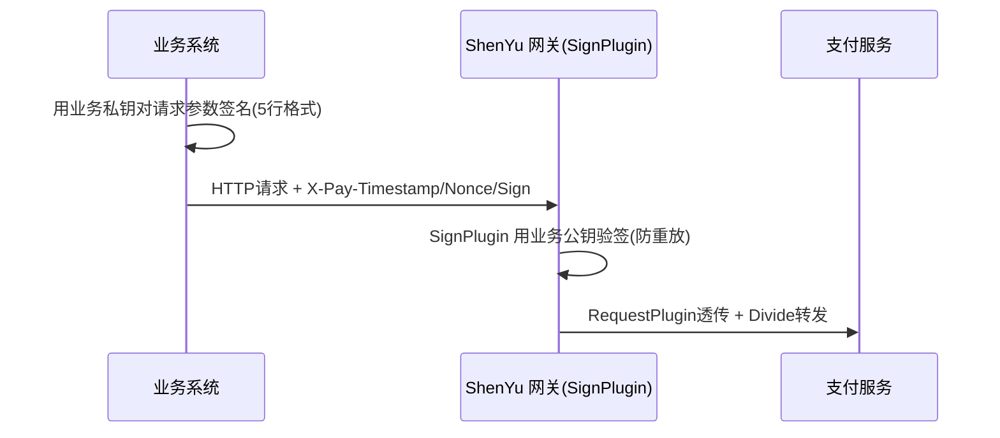
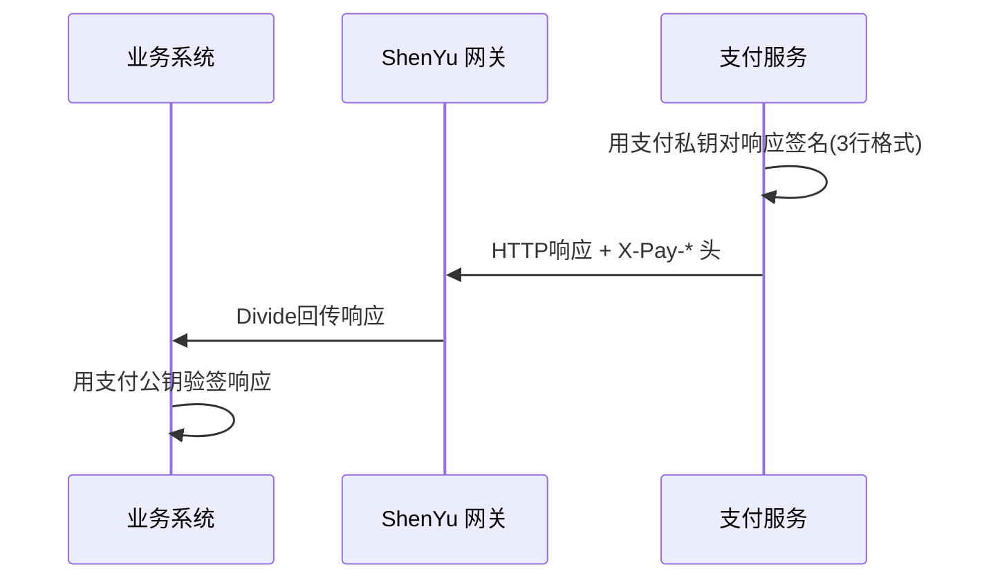
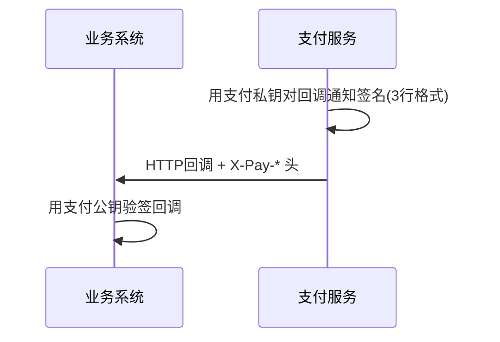

# ShenYu 加签验签验证手册（SignPlugin × RequestPlugin × DividePlugin）
> 适用版本：ShenYu admin/bootstrap 2.6.x ~ 2.7.x（网关侧），客户端侧基于本仓库 `shenyu-client-core` 的 `sign` 包。  
协议基准：支付服务（微信支付 V3 风格）—— RSA-SHA256 非对称签名。
>
> 本手册与 `divide-plugin-验证手册.md` 配套：divide 关注"转发"，本手册关注"安全"。
>

---

## 一、需求背景与协议总览
### 1.1 什么时候需要加签与验签
业务系统调用支付接口时，双方需基于非对称密钥互相验证身份与报文完整性，并防止重放。  
每个参与方各持有一对 RSA 密钥（自己的私钥 + 自己的公钥），并把**自己的公钥**交给对方保管：

| 参与方 | 自己持有（用于加签） | 保管对方的（用于验签） |
| --- | --- | --- |
| 业务系统（BIZ） | 业务系统私钥 | 支付服务公钥 |
| 支付服务（PAY） | 支付服务私钥 | 业务系统公钥 |


> 关键原则：**私钥永不离开持有方，只在本地加签时使用；公钥交给对方，对方用来验签。**
>

一次完整交易是**串联的两段**（不是三个独立场景），时序如下：

1. **请求段（BIZ → PAY）**：业务系统发起支付请求，用【业务系统私钥】对请求加签生成 sign；  
支付服务收到后用【业务系统公钥】验签。**验签通过后才会处理业务**。
2. **响应段（PAY → BIZ）**：支付服务处理完业务，用【支付服务私钥】对响应数据加签生成 sign，连同响应一起返回；  
业务系统收到后用【支付服务公钥】验签响应。
3. **回调段（PAY → BIZ，可选，异步）**：支付服务在交易状态变化时，用【支付服务私钥】对回调通知加签，  
POST 给业务系统的回调地址；业务系统用【支付服务公钥】验签。验签逻辑与响应段一致。

| 场景 | 加签方 | 加签所用私钥 | 验签方 | 验签所用公钥 |
| --- | --- | --- | --- | --- |
| 请求（BIZ→PAY） | 业务系统 | 业务系统私钥 | 支付服务 | 业务系统公钥 |
| 响应（PAY→BIZ） | 支付服务 | 支付服务私钥 | 业务系统 | 支付服务公钥 |
| 回调通知（PAY→BIZ） | 支付服务 | 支付服务私钥 | 业务系统 | 支付服务公钥 |


### 1.2 协议要素（本仓库 `shenyu-client-core` 的 `sign` 包已实现）
| 要素 | 约定 |
| --- | --- |
| 传输 | HTTPS（请求时不忽略证书校验） |
| 数据格式 | JSON（UTF-8），`Content-Type: application/json; charset=utf-8` |
| 签名算法 | `SHA256withRSA`（标准 JCA，JDK8 原生支持） |
| 加签结果 | Base64 编码字符串 |
| HTTP 头 | `X-Pay-Timestamp`（秒级）/ `X-Pay-Nonce`（32位hex）/ `X-Pay-Sign`（签名值） |


### 1.3 待签名串格式
**请求加签（5 行格式，每行 **`\n`** 结尾，含最后一行）**：

```plain
HTTP请求方法\n
URL\n                              ← 绝对路径，不含 scheme/host；GET 含完整 query string
请求时间戳\n
请求随机串\n
请求报文主体\n                       ← GET 为空行
```

**响应/回调验签（3 行格式）**：

```plain
应答时间戳\n
应答随机串\n
应答报文主体\n                       ← 204 时仅为一个 \n
```

> 字段名与算法常量定义见 `org.apache.shenyu.client.core.sign.SignConstants`。
>

---

## 二、本仓库已交付的客户端能力
客户端侧工具位于 `shenyu-client-core` 模块的 `org.apache.shenyu.client.core.sign` 包（6 个类）：

| 类 | 职责 |
| --- | --- |
| `SignConstants` | 协议常量（Header 名 / 算法 / 分隔符） |
| `PemUtils` | PEM 密钥加载（PKCS#8 私钥 / X.509 公钥） |
| `SignStringBuilder` | 待签名串构造（请求 5 行 / 响应 3 行） |
| `RsaSigner` | SHA256withRSA 加签与验签（标准 JCA） |
| `PaySignInterceptor` | OkHttp 出站请求自动加签（业务系统侧） |
| `PaySignVerifier` | 响应验签 / 回调验签 / 入站请求验签 + 防重放 |


**正确性已验证**：

+ `SignStringBuilderTest`：用需求文档 4 个请求示例 + 响应示例逐一断言输出完全一致。
+ `RsaSignerTest`：round-trip（运行时生成密钥对加签验签）+ **跨工具一致性锚点**（OpenSSL 生成的真实密钥+签名，Java `verify` 与 OpenSSL `dgst -verify` 均为 "Verified OK"）。
+ Demo `shenyu-sign-demo`：本地闭环跑通请求加签→请求验签→响应加签→响应验签→回调加签→回调验签。

> 说明：需求文档示例公开的公钥与签名值经 OpenSSL 直接验证为 Verification failure（两者非同一密钥对产生），故测试改用可复现的 OpenSSL 真实匹配数据作为锚点；签名串格式与文档完全一致。
>

---

## 三、三插件协作架构（网关侧）
> 注意：`SignPlugin` / `RequestPlugin` / `DividePlugin` 的实现位于 apache/shenyu **主仓库**（网关侧），本客户端仓库不含其源码。本节描述它们如何协作承载支付加签验签。
>

### 3.1 架构与执行顺序
```plain
┌─────────────┐    ┌──────────────┐    ┌────────────────┐    ┌──────────────┐
│  SignPlugin │───▶│RequestPlugin │───▶│  ContextPath   │───▶│ DividePlugin │
│ (前置治理)  │    │  (改头/透传)  │    │   Plugin       │    │ (末端转发)   │
│ • 验签请求  │    │ • 注入/移除头 │    │ • 路径剥离     │    │ • 路由匹配   │
│ • 防重放    │    │ • 动态值(SpEL)│    │               │    │ • 负载均衡   │
└─────────────┘    └──────────────┘    └────────────────┘    └──────────────┘
       ▲                   ▲                                        │
       │                   │                                        ▼
  Admin 热推送         Admin 热推送                              WebClient
  (密钥/算法)          (Header 规则)                             (HTTP 转发)
```

插件 `getOrder()` 默认顺序（**切勿手动调乱**）：

```plain
SignPlugin(50) < RequestPlugin(100) < DividePlugin(200)
```

> ❌ 错误顺序：`Divide → Sign → Request`（Divide 已转发，后续插件无法拦截）  
✅ 正确顺序：`Sign → Request → Divide`（先验签、再改头、最后转发）
>

### 3.2 三大场景时序
**场景一：请求加签 + 请求验签**（对应需求文档「加签」时序图）



**场景二：响应加签 + 响应验签**（对应需求文档「验签」时序一）



**场景三：回调通知加签 + 验签**（对应需求文档「验签」时序二）



> 场景二、三的验签在业务系统侧完成（本仓库 `PaySignVerifier`），可不经网关。
>

---

## 四、网关侧自定义验签 SPI 代码模板（apache/shenyu 主仓库）
ShenYu 原生 `SignPlugin` 默认用 AES 对称签名。要承载本套 RSA 协议，需在网关侧实现自定义 `SignService` SPI。

### 4.1 实现 SignService（网关侧，主仓库 shenyu-plugin-sign 模块）
```java
package org.apache.shenyu.plugin.sign.custom;

import org.apache.shenyu.plugin.sign.api.SignService;
import org.apache.shenyu.plugin.sign.api.SignContext;
import org.apache.shenyu.spi.Join;
import java.security.PublicKey;
import java.util.Base64;
import java.security.Signature;

/**
 * 微信支付 V3 风格 RSA-SHA256 验签 SPI。
 * 与客户端 org.apache.shenyu.client.core.sign.RsaSigner 的 verify 逻辑完全一致。
 */
@Join
public class PayRsaSignService implements SignService {

    @Override
    public boolean signVerify(final byte[] body, final SignContext signContext) {
        try {
            // 1. 取业务系统公钥（按 appKey 从配置/缓存查）
            PublicKey publicKey = resolvePublicKey(signContext.getAppKey());
            // 2. 构造 5 行待签名串：method\nurl\nts\nnonce\nbody\n
            String signString = buildRequestSignString(signContext, new String(body));
            // 3. SHA256withRSA 验签
            byte[] sig = Base64.getDecoder().decode(signContext.getSign());
            Signature verifier = Signature.getInstance("SHA256withRSA");
            verifier.initVerify(publicKey);
            verifier.update(signString.getBytes("UTF-8"));
            return verifier.verify(sig);
        } catch (Exception e) {
            return false;
        }
    }

    private String buildRequestSignString(final SignContext ctx, final String body) {
        return ctx.getHttpMethod() + "\n"
                + ctx.getPath() + "\n"        // 含 query string
                + ctx.getTimestamp() + "\n"
                + ctx.getNonce() + "\n"
                + (body == null ? "" : body) + "\n";
    }

    private PublicKey resolvePublicKey(final String appKey) {
        // TODO: 按 appKey 查业务系统公钥（从 Admin 配置或缓存）
        throw new UnsupportedOperationException("按实际密钥管理实现");
    }
}
```

### 4.2 SPI 声明
在网关 bootstrap 的 classpath 下创建：

```plain
META-INF/shenyu/org.apache.shenyu.plugin.sign.api.SignService
```

内容：

```plain
payRsa=org.apache.shenyu.plugin.sign.custom.PayRsaSignService
```

### 4.3 SignPlugin 头字段适配
ShenYu 原生从 `ShenYu-Authorization`(v2) 或 `appKey/sign/version`(v1) 头取参。本套协议用 `X-Pay-*` 头，需确保 SignPlugin 读取头时映射到 `X-Pay-Timestamp` / `X-Pay-Nonce` / `X-Pay-Sign`（修改 `SignPlugin` 的头提取逻辑，或在 RequestPlugin 中提前把 `X-Pay-*` 改写为原生头名）。

---

## 五、RequestPlugin 配置示例（Admin）
用于注入链路追踪、透传签名头等：

**Selector**（选择器，匹配 `/v3/pay/**`）：

```json
{
  "name": "/v3/pay/**",
  "pluginName": "request",
  "matchMode": 0,
  "type": 1,
  "sort": 100,
  "enabled": true,
  "conditionDataList": [
    {"paramType": "uri", "operator": "match", "paramValue": "/v3/pay/**"}
  ]
}
```

**Rule Handle**（请求头处理）：

```json
{
  "header": {
    "addHeaders": {
      "X-Trace-Id": "${req.header.X-Trace-Id}"
    },
    "setHeaders": {
      "Content-Type": "application/json; charset=utf-8"
    },
    "removeHeaders": ["X-Internal-Token"]
  }
}
```

---

## 六、DividePlugin 转发配置示例（Admin）
> 详细字段见 `divide-plugin-验证手册.md`。此处仅给出最小可用配置。
>

**Selector**（选择器）：

```json
{
  "name": "/v3/pay",
  "pluginName": "divide",
  "type": 1,
  "matchMode": 0,
  "sort": 200,
  "enabled": true,
  "conditionDataList": [
    {"paramType": "uri", "operator": "match", "paramValue": "/v3/pay/**"}
  ]
}
```

**Rule Handle**（转发参数）：

```json
{
  "loadBalance": "roundRobin",
  "retry": 1,
  "timeout": 3000,
  "headerMaxSize": 10240,
  "requestMaxSize": 10240,
  "upstream": [
    {"protocol": "http://", "upstreamHost": "127.0.0.1", "upstreamUrl": "127.0.0.1:8390", "weight": 50}
  ]
}
```

---

## 七、风险与避坑指南
### 7.1 Body 参与签名需缓存请求体
WebFlux 的请求体只能读取一次。SignPlugin 验签需读 body，DividePlugin 转发也要读 body，会冲突。

**解决方案**：在 SignPlugin 之前启用 `CacheRequestBodyPlugin`（缓存请求体供多次读取）。注意内存开销，仅对需要验签的路由开启。

### 7.2 插件顺序不可调乱
`SignPlugin` 必须在 `DividePlugin` 之前，否则请求已被转发，验签无法拦截。默认 `getOrder()` 顺序正确，切勿手动改为 `Divide < Sign`。

### 7.3 RequestPlugin 改头与签名字段的冲突
若 RequestPlugin 添加的 Header 恰好参与签名计算（如 `X-Pay-Sign` 本身），会导致下游验签失败。

**原则**：RequestPlugin 添加的头（如 `X-Trace-Id`）不应进入签名串；签名相关的 `X-Pay-*` 头由加签方产生，RequestPlugin 只透传不修改。

### 7.4 现有 JWT 注册鉴权互不干扰
本客户端仓库现有的 `X-Access-Token`（JWT）是**注册/心跳**到 ShenYu Admin 的鉴权，与支付业务的 `X-Pay-*` 签名是**两条独立链路**：

+ `RegisterUtils`（`shenyu-client-core`）→ Admin：JWT 鉴权，不变。
+ 业务系统 → 网关 → 支付服务：`X-Pay-*` 签名，本手册主题。

两者 Header 名不同、用途不同，互不影响。

### 7.5 时间戳防重放
所有验签都应校验 `X-Pay-Timestamp` 与服务器时间差（建议 ±300 秒）。本仓库 `PaySignVerifier.checkTimestamp` 已实现，Demo `PayService` / `BizController` 均已启用。

### 7.6 响应验签必须用原始报文
若 Web 框架（如某些 Jackson 配置）重新格式化响应 JSON（改变字段顺序/空格），会导致响应验签失败。验签务必使用**原始报文字节**。本仓库 `PaySignVerifier.verifyResponse` 直接读取 OkHttp 响应字节流，不经过反序列化。

---

## 八、多方论证小结：为什么选微信支付 V3 协议
| 方案 | 算法 | 签名串 | 契合本需求 | 备注 |
| --- | --- | --- | --- | --- |
| **微信支付 V3（本方案）** | SHA256withRSA | 方法\nURL\nts\nnonce\nbody\n | ✅ 完全对应 | 非对称、防篡改、防重放 |
| ShenYu 原生 SignPlugin | AES（对称） | appKey+ts+nonce+path | ❌ 算法/字段均不同 | 需 SPI 改造为 RSA |
| Alipay SDK | RSA2 | sorted params + body | ⚠️ 字段体系不同 | 适合支付宝场景 |
| AWS Sig V4 | HMAC 派生 key | 多步派生 | ❌ 过重 | 适合 AWS 云服务 |


**选型理由**：需求文档明确为支付场景 + RSA-SHA256 + `X-Pay-*` 头 + 5 行/3 行签名串格式，与微信支付 V3 完全对应，故严格采用该协议。ShenYu 网关侧通过自定义 `SignService` SPI 承接（第四章），客户端侧用本仓库 `sign` 包（第二章）。

---

## 九、Demo 快速验证
本仓库 `shenyu-sign-demo` 模块提供本地闭环验证（不依赖真实网关）：

```bash
cd shenyu-sign-demo
mvn spring-boot:run
```

另开终端：

```bash
# 场景一+二：请求加签→请求验签→响应加签→响应验签
curl http://localhost:8390/biz/pay

# 场景三：回调通知加签→回调验签
curl -X POST http://localhost:8390/v3/pay/notify-trigger
```

控制台日志会打印每个环节的签名串、签名值、验签结果，便于核对。

密钥文件位于 `shenyu-sign-demo/src/main/resources/keys/`（仅供 Demo，**禁止生产使用**）。


## 十、网关验签失败返回真实 HTTP 401
网关验签失败返回真实 HTTP 401  
需要在 `PayRsaSignService` 里直接操作 `exchange` 的响应状态（但这绕过了` ShenYu `的标准错误返回机制，需谨慎）。标准做法是接受`「HTTP 200 + body code:401」`——这也是微信支付 V3、支付宝等主流支付网关的惯例（业务错误用 body code 区分，传输层保持 200，便于客户端统一解析）。

## 实现：网关验签失败返回真实 HTTP 401
### 实现方式
在 `PayRsaSignService` 里封装了 `fail401(exchange, reason)` 辅助方法，所有验签失败出口统一调用：

```java
private VerifyResult fail401(final ServerWebExchange exchange, final String reason) {
    exchange.getResponse().setStatusCode(HttpStatus.UNAUTHORIZED);
    return VerifyResult.fail(reason);
}
```

### 原理（为什么这样能生效）
```plain
PayRsaSignService.signatureVerify()
    └─ 验签失败 → fail401(exchange, reason)
         ├─ exchange.getResponse().setStatusCode(401)   ← 此刻 response 未 committed
         └─ return VerifyResult.fail(reason)
              ↓
SignPlugin.doExecute() 检测 isFailed()
    └─ WebFluxResultUtils.failedResult(401, reason, exchange)
         └─ WebFluxResultUtils.result(exchange, error)
              └─ exchange.getResponse().writeWith(body)   ← writeWith 沿用已设的 401
```

关键时序：`setStatusCode(401)` 发生在 `SignService` 返回前，**早于** `WebFluxResultUtils.result()` 写 body。Spring WebFlux 的 `writeWith` 会使用 response 上已设置的状态码（401），而 `WebFluxResultUtils.result()` 本身不覆盖状态码，所以 401 得以保留。

### 改动前后对比（实测）
| 请求 | 改动前 | 改动后 |
| --- | --- | --- |
| 无签名头 POST 网关 | `HTTP/1.1 200 OK` + body `{"code":401,...}` | `HTTP/1.1 401 Unauthorized` + body `{"code":401,...}` |
| 正常带签名请求 | `HTTP/1.1 200` | `HTTP/1.1 200`（不受影响） |


### 涉及的 4 个失败出口（全部已改为真实 401）
1. 缺少签名头（`missing X-Pay-* header`）
2. 时间戳格式错误（`invalid timestamp format`）
3. 时间戳过期（`timestamp expired`）
4. 签名校验失败（`sign verify failed`）+ 验签异常（`verify error`）

网关现已部署新版 jar，BIZ/PAY 无需改动即可生效。后续任何验签失败的请求，网关都会直接返回真实 HTTP 401，客户端可用 HTTP 状态码做传输层错误判断，同时 body 里的 `code:401` 仍保留供业务层使用。


```bash
{
    "步骤3_BIZ响应验签结果": "通过（PAY公钥验签成功）",
    "步骤2_PAY响应体": "{\"code\":\"SUCCESS\",\"data\":{\"trade_no\":\"db3020c7cbbf4a9bbace610195300f19\",\"prepay_id\":\"wxdb3020c7cbbf4a9b\"},\"message\":\"ok\"}",
    "步骤2_PAY处理并加签响应_httpCode": 200,
    "步骤1_请求体": "{\"appid\":\"wxd678efh567hg6787\",\"mchid\":\"1900007291\",\"description\":\"Image形象店-深圳腾大-QQ公仔\",\"out_trade_no\":\"1217752501201407033233368018\",\"amount\":{\"total\":100,\"currency\":\"CNY\"}}",
    "目标URL": "http://localhost:9196/pay-demo/v3/pay/transactions/jsapi",
    "步骤2_响应签名头": "ts=1782954807 nonce=49472b7107ae4ba8b953f37c28f3c089",
    "步骤1_BIZ加签全过程_私钥加密": {
        "算法": "SHA256withRSA（业务私钥加密）",
        "待签名串_5行_换行替换": "POST↩/pay-demo/v3/pay/transactions/jsapi↩1782954807↩cecb5b33440148c4a73b3422e62958d2↩{\"appid\":\"wxd678efh567hg6787\",\"mchid\":\"1900007291\",\"description\":\"Image形象店-深圳腾大-QQ公仔\",\"out_trade_no\":\"1217752501201407033233368018\",\"amount\":{\"total\":100,\"currency\":\"CNY\"}}↩",
        "method": "POST",
        "签名值_sign": "ghyVWQbBoEMw22RAE86TnLjpQWLX6Gxz+DRdmsxrMo+dqTOZDeRaMj+8qN76Gi9WAu1n0H1xdTon4zpNZSXzvLziM3Z5RegjnKzfqZ5Vc56wb+mXfpESd4Kg08k9+0kFU27+ko5+KYcOoStlJbRj+1zfsu8b9212Fm8vXziqkHwN5ATJUaEPM+FNmsrJuuPjhe4ryEzWt26VR2IYzn7xHMmr2KPDCvh1bDDdOqeQZ8YKNWYKb3ZiDCeeVH7iCkos5gZV/NRproKPW2bAYas16qcmc3BmQ984Yg+R4JG+TXXYAPqV/mPJy2ovLnfPmmoAh5yoMwP5Wl0VgiD+L8Z8Vg==",
        "注入请求头": "X-Pay-Timestamp / X-Pay-Nonce / X-Pay-Sign",
        "nonce": "cecb5b33440148c4a73b3422e62958d2",
        "url": "/pay-demo/v3/pay/transactions/jsapi",
        "timestamp": "1782954807"
    }
}

```


```bash
{
    "步骤3_BIZ响应验签结果": "失败",
    "步骤2_PAY响应体": "{\"code\":401,\"message\":\"verify error: Input byte array has incorrect ending byte at 344\"}",
    "步骤2_PAY处理并加签响应_httpCode": 401,
    "步骤1_请求体": "{\"appid\":\"wxd678efh567hg6787\",\"mchid\":\"1900007291\",\"description\":\"Image形象店-深圳腾大-QQ公仔\",\"out_trade_no\":\"1217752501201407033233368018\",\"amount\":{\"total\":100,\"currency\":\"CNY\"}}",
    "目标URL": "http://localhost:9196/pay-demo/v3/pay/transactions/jsapi",
    "步骤2_响应签名头": "无(验签失败或非加签响应)",
    "步骤1_BIZ加签全过程_私钥加密": {
        "算法": "SHA256withRSA（业务私钥加密）",
        "待签名串_5行_换行替换": "POST↩/pay-demo/v3/pay/transactions/jsapi↩1782954970↩5b10eb9f2c524f0f92e0c5b2f2c62b99↩{\"appid\":\"wxd678efh567hg6787\",\"mchid\":\"1900007291\",\"description\":\"Image形象店-深圳腾大-QQ公仔\",\"out_trade_no\":\"1217752501201407033233368018\",\"amount\":{\"total\":100,\"currency\":\"CNY\"}}↩",
        "method": "POST",
        "签名值_sign": "uJcSgY0KNwygye64+PsnvHVMahFnXKA/Zw9RZxhb3WO1/+SyQZDR7+tx+lsWdpZ4nbeH1Bj1oG23BqxE6AVMx5IjqVDanb0UKhxFbMQvxx+G0/eFfw6ztIrBBOtGthiIm9JP4rQiM0DdgAJ5GWzAwKvEeMKNVcw3yPbJLnzrxOW2ceHHjo8RBz9+BMCKZ2Hg77JMwMA7ISexmqkDtxB/5Q5JV50UpM5LyzOSQyC0t6wUocaCCrP2f3qYh0pnbFqs637Kf0qS7ARejslo73pOJ+sCVJQgYWL5hEMTSOL9cuR9A2S+FNXnAyHjf6ajyh5iPMMU+Th96hXzGum9UamyEw==",
        "注入请求头": "X-Pay-Timestamp / X-Pay-Nonce / X-Pay-Sign",
        "nonce": "5b10eb9f2c524f0f92e0c5b2f2c62b99",
        "url": "/pay-demo/v3/pay/transactions/jsapi",
        "timestamp": "1782954970"
    }
}

```

