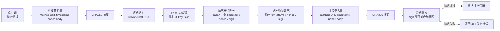

## 由浅入深地为您剖析“时间戳防重放”机制，结合您提供的 `PayRsaSignService` 代码进行深度解析。
### 一、 本质：给请求贴一张“过期日期”
**核心概念**：  
时间戳防重放的本质，是为每一次网络请求赋予一个**“生命周期”**。  
**通俗类比**：  
想象您去银行取钱。

+ **签名**：相当于您的**身份证**，证明“我是我”。
+ **时间戳**：相当于存折或支票上的**签发日期**。  
如果有人捡到了您昨天取钱的支票（截获了昨天的请求），即使他能完美伪造您的签名（签名验证通过），银行柜员一看日期是昨天的，也会拒绝兑现。因为这张票据已经“过期”了。  
在数字世界中，时间戳确保了：**“即使签名正确，请求也不能是‘老掉牙’的旧数据。”**

---

### 二、 形成原因：为什么光有签名还不够？
很多开发者会误以为：“我用了 RSA 非对称加密签名，数据很安全，为什么还要加时间戳？”  
**根本原因在于：签名只能保证“完整性”和“身份认证”，无法保证“时效性”。**

1. **中间人攻击的局限性**：  
虽然 HTTPS 加密传输，但在某些极端情况下（如客户端中毒、代理服务器被劫持、局域网监听），黑客可能截获了一个合法的请求包。
    - 该请求包：`Method=POST`, `URL=/pay`, `Body=转账100元`, `Sign=xxxxx`。
    - 由于签名是针对内容计算的，黑客即使不解密，只要原样发送这个包，服务器就会认为是一次合法的请求。
2. **重放攻击**：  
黑客不需要破解密码，只需要做一个“复读机”。
    - 你给老婆转账 100 元，黑客截获了这个请求。
    - 黑客把你这个请求原封不动向服务器发送 100 次。
    - 结果：你损失了 1 万元。  
**引入时间戳的原因**：为了让服务器能区分“这是用户刚刚发出的请求”还是“黑客复制的旧请求”。

---

### 三、 现象：如果不防重放会发生什么？
如果不加时间戳校验，系统会出现极其诡异的现象：

1. **重复扣款/发货**：  
用户只点了一次“支付”，后台却收到了多次扣款通知，导致余额异常减少。
2. **数据洪水**：  
黑客可以截获一个“查询用户列表”的请求，然后编写脚本疯狂重放。虽然每次查询都合法，但数据库会被这种高并发查询压垮，导致服务瘫痪。
3. **逻辑漏洞**：  
某些业务逻辑如果缺乏幂等性设计，重放可能导致账号状态混乱（如优惠券被重复使用）。

---

### 四、 核心处理办法（结合代码深度讲解）
在您的代码中，处理逻辑集中在 `signatureVerify` 方法的前半部分。核心办法分为三步：**“取时间”、“算差值”、“判生死”**。

#### 1. 取时间：客户端与服务端对表
```java
String timestamp = request.getHeaders().getFirst(X_PAY_TIMESTAMP);
// ...
long ts = Long.parseLong(timestamp);
long now = Instant.now().getEpochSecond();
```

+ **客户端**：发送请求时，在 Header 里带上当前的 Unix 时间戳（秒或毫秒）。
+ **服务端**：收到请求时，立即获取服务器当前时间 `now`。
+ **关键点**：这个时间戳是**参与签名计算**的（代码后半部分的 `signString` 包含了 `timestamp`）。
    - 这意味着黑客不能随意修改时间戳。如果黑客把旧请求的时间戳改成当前时间，签名就会对不上，验签直接失败。

#### 2. 算差值：容忍网络延迟
```java
private static final long TIMESTAMP_TOLERANCE_SECONDS = 300L; // 5分钟容忍度
// ...
if (Math.abs(now - ts) > TIMESTAMP_TOLERANCE_SECONDS) {
    // 拒绝请求
}
```

这里最核心的设计是 `Math.abs(now - ts)` 和 **容忍度**。  
**深度解析：为什么要用绝对值 **`Math.abs`**？**  
这处理了两种异常情况：

+ **情况 A：请求来自过去（重放攻击）**
    - `ts < now`（例如：请求是 1 小时前发出的）。
    - `now - ts` 是一个很大的正数。
    - **判定**：差值超过 300 秒，判定为过期请求，拦截。这是防重放的核心。
+ **情况 B：请求来自未来（时钟漂移）**
    - `ts > now`（例如：客户端服务器时间是 12:05，网关服务器时间是 12:00）。
    - `ts - now` 是一个正数。
    - **判定**：如果不用绝对值，这个请求会被放行；如果用了绝对值，且差值过大（比如客户端时间快了 10 分钟），请求会被拦截。
    - **意义**：防止因客户端时间过快导致的潜在逻辑问题，同时也增加了黑客伪造时间戳的难度（黑客不能把时间戳设得太离谱）。  
**为什么设置 300秒（5分钟）？**  
这是一个经验值，平衡了**安全性**与**可用性**。
+ 太短（如 10秒）：如果网络拥堵，正常的请求到达服务器时可能已经超时，用户体验极差。
+ 太长（如 24小时）：黑客有很长的时间窗口可以截获并重放请求。

#### 3. 进阶：时间戳的局限性与 Nonce 的配合
**仅靠时间戳够吗？**  
看您的代码，只校验了时间戳。这实际上留了一个**“时间窗口漏洞”**。  
如果在 **300秒内**，黑客截获了请求并立即重放：

+ 时间戳：合法（因为才过去几秒）。
+ 签名：合法（原文未改）。
+ **结果**：请求通过。  
**这就是为什么您的代码里还获取了 **`X-Pay-Nonce`**（随机串）的原因。**  
完整的防重放体系通常是 **“时间戳 + 随机串”** 双重保险：
1. **时间戳（第一道防线）**：  
快速过滤掉那些明显过期的请求（如 1 小时前的），无需查库，性能高。
2. **随机串 Nonce（第二道防线）**：  
解决“时间窗口内”的重放问题。
    - 服务器收到请求后，将 `nonce` 存入 Redis，设置过期时间为 300秒。
    - 下次收到相同的 `nonce`，查 Redis 发现已存在，直接拒绝。  
**您的代码现状分析**：  
您的 `PayRsaSignService` 目前只做了时间戳校验，这在 API 网关层面属于**“轻量级防重放”**。它足以防止“历史数据重放”，但无法防止“实时截获并在几秒内重放”。
+ **建议**：如果是对资金极其敏感的业务（如支付），建议在 `signatureVerify` 方法中增加 Redis 查重逻辑，校验 `nonce` 是否已被使用过。

### 总结
`PayRsaSignService` 中的这段逻辑：

```java
if (Math.abs(now - ts) > TIMESTAMP_TOLERANCE_SECONDS) {
    LOG.warn("[GW-Sign] 时间戳过期...");
    return fail401(exchange, "timestamp expired");
}
```

是 API 安全的**基石**。它通过极低的计算成本（一次减法），过滤掉了 99% 的盲目重放攻击（那些很久以前的请求），迫使攻击者必须在极短的时间窗口内完成攻击，大大提高了攻击难度和系统安全性。


---

## 1. 澄清一个关键概念：签名 ≠ 加密
你现在用的是 **RSA-SHA256 数字签名**，不是“私钥加密”。  
微信支付 / 抖音开放平台 / ShenYu 这种 V3 风格的签名规范里，签名串的标准结构都是 5 行：

```latex
HTTP请求方法\n
URL\n
请求时间戳\n
请求随机串\n
请求报文主体\n
```

然后对这串 UTF-8 字节做：

1. 先算 SHA-256 摘要；
2. 再用 **私钥** 对摘要做 RSA 签名（SHA256withRSA）；
3. 最后把签名结果做一次 Base64 编码，得到 `X-Pay-Sign` 的值。  
微信官方文档也明确写了这 5 行签名串结构。  
**重点：**
+ “被签名”的东西是这串 **文本（method / URL / timestamp / nonce / body）**；
+ “加密”只发生在 **对 SHA-256 摘要做 RSA 运算这一步**；
+ 中间任何一段内容（包括 timestamp）只要改一个字符，SHA-256 摘要就会完全变化，最终签名对不上。

---

## 2. 为什么“改时间戳签名就对不上”？
你的代码里，签名串是这样拼的（`PaySignInterceptor.intercept`）：

```java
String signString = SignStringBuilder.buildRequestSignString(method, url, timestamp, nonce, body);
String sign = RsaSigner.sign(signString, bizPrivateKey);
```

`SignStringBuilder.buildRequestSignString` 实际就是类似：

```java
public static String buildRequestSignString(String method, String url, String timestamp, String nonce, String body) {
    return method + "\n" + url + "\n" + timestamp + "\n" + nonce + "\n" + body + "\n";
}
```

也就是说：

+ **参与签名的字段：**
    - HTTP 方法（GET / POST 等）
    - URL（path + query）
    - **时间戳**
    - 随机串
    - 请求体
+ **签名过程：**
    1. 把这 5 个东西按 `\n` 拼成一个字符串 `signString`；
    2. 对 `signString` 做 SHA-256；
    3. 用私钥对 SHA-256 结果做 RSA 签名；
    4. Base64 编码结果得到 `sign`。  
所以：

> 如果黑客把旧请求的 `X-Pay-Timestamp` 改成当前时间，**但手里没有私钥**，他就没法重新算出合法的签名。  
原因就是：
>

+ 他能改 Header 里的 `X-Pay-Timestamp`；
+ 但这个新时间戳 **不在原来的签名串里**，他如果只改 Header：
    - 服务端会用新的时间戳 + 旧的 URL / body / nonce 去拼签名串；
    - 用你的公钥验签，得到的签名值是旧的 `sign`；
    - 结果就是：签名串变了，签名值没跟着变 → 验签失败。

---

## 3. “当前加密逻辑是不是把所有请求体都私钥加密了？”
**不是。**  
更准确地说是：

> 当前逻辑是：**对请求元数据（method / URL / timestamp / nonce / body）做摘要并签名，而不是对整个请求做加密。**
>

### 3.1 区分“签名”和“加密”
+ **签名（Signature）**
    - 目的：**防篡改、防伪造**。
    - 做法：对原文做摘要（SHA-256），再用私钥对摘要做签名。
    - 结果：别人可以用公钥验证“这段数据确实是你发出的，且中间没被改过”。
    - 原文本身是否加密，签名机制不管。
+ **加密（Encryption）**
    - 目的：**防偷看**。
    - 比如 HTTPS 对 HTTP 做加密，或者用 AES-GCM 对 JSON body 加密。
    - 你的代码里没有这一层：body 在传输层仍然是明文（依赖 HTTPS 保护）。

### 3.2 时间戳、随机串、请求体的角色
在你的 `PaySignInterceptor` 里：

```java
String signString = SignStringBuilder.buildRequestSignString(method, url, timestamp, nonce, body);
```

+ **时间戳 & 随机串**：
    - 参与 **签名串的构造**；
    - 因此会 **间接影响签名值**；
    - 同时时间戳还用于服务端做“防重放”（你代码里的 `Math.abs(now - ts) > 300` 判断）。
+ **请求体（body）**：
    - 同样参与签名串；
    - 签名是对 **整个 body 的原文** 做摘要，而不是对“加密后的 body”做摘要；
    - 所以 body 任何改动，都会导致签名失败。  
也就是说：

> 你的实现里，**method / URL / timestamp / nonce / body 这 5 个字段都会参与签名，任何一个被篡改，都会导致验签失败**。  
但它们都是“被签名”的对象，而不是“被加密”的对象。
>

---

## 4. 用一个简短流程图总结一下
下面是整个签名 / 验签流程中，“时间戳被改”会发生什么：



黑客在中间修改 `X-Pay-Timestamp`：

+ 他可以改 Header 里的 `X-Pay-Timestamp`；
+ 但他改不了 **签名串里的 timestamp**，因为他没有私钥重新签名；
+ 于是网关侧拼接出的签名串，和原来那个 `sign` 对不上 → 验签失败。

---

## 5. 回答你的两个原问题
### Q1：黑客把旧请求的时间戳改成当前时间，签名就会对不上，但代码里没有“时间戳加密”？
+ 是的，**没有“时间戳加密”**，时间戳只是作为签名串的一部分参与签名。
+ 关键点：
    - 签名串里包含时间戳；
    - Header 里的 `X-Pay-Timestamp` 必须和签名串里用的那个时间戳一致；
    - 签名是用私钥算出来的，黑客没有私钥，就不能为新的时间戳重新生成合法签名。  
所以一句话：  
**时间戳没有被“加密”，但被“签名”了；改了时间戳，签名就对不上。**

### Q2：当前的加密逻辑是把所有的请求体都私钥加密了吗？包含整个参数和时间戳和随机串？
+ 不是“加密”，是 **签名**。
+ “被签名”的内容包括：
    - HTTP 方法（method）
    - URL（path + query）
    - **时间戳**
    - **随机串**
    - **请求体**
+ 签名算法是：
    - 对这 5 个部分拼成的字符串做 SHA-256；
    - 再用私钥对 SHA-256 结果做 RSA 签名（SHA256withRSA）；
    - 最后 Base64 编码。
+ 所以：
    - **任何字段被篡改（包括时间戳、nonce、body、URL）都会导致签名失败**；
    - 但这些字段本身并没有被“加密”，还是明文传输（依赖 HTTPS 做传输层加密）。

---

## 6. 一个小建议（与时间戳无关）
## 你现在的实现里，`PaySignInterceptor` 在最后加 header 时写的是：  
```java  
.addHeader(SignConstants.X_PAY_SIGN, sign+"1111")  
// .addHeader(SignConstants.X_PAY_SIGN, sign)  
```  
也就是故意把签名搞错，用于测试。正式上线时记得改回：  
```java  
.addHeader(SignConstants.X_PAY_SIGN, sign)  
```  
否则所有请求都会验签失败。
总结一句：

> 时间戳、随机串、URL、请求体，都是“被签名”的内容，而不是“被加密”的内容；  
黑客改了时间戳，就破坏了签名串和签名的对应关系，所以验签会失败。
>

```java
        LOG.info("[BIZ-Sign] 签名串(5行)={}", replaceNewline(signString));
```

这行日志的作用非常关键，它是**开发调试、故障排查、对接联调**时的“显微镜”。  
在分布式系统的签名验证中，最让人头疼的问题往往是：“**明明我都按要求拼了，为什么还是验签失败？**”  
这行日志的核心价值在于：**它完整打印了“待签名串”的原始内容**。

### 1. 它是排查验签失败的“唯一标准”
签名算法（SHA256withRSA）是对一串**字节**进行计算。只要这串字节变了一个字符、甚至多了一个空格、少了一个换行符，签名结果都会天差地别。  
当网关返回 `401 Unauthorized` 验签失败时，这行日志能帮你回答以下终极问题：

+ **URL 是否一致？**
    - 客户端打印：`GET↩/pay-demo/v3/pay/transactions/jsapi?abc=123↩...`
    - 网关打印：`GET↩/pay-demo/v3/pay/transactions/jsabi?abc=123↩...` (注意拼写错误)
    - **结论**：URL 拼写不一致导致验签失败。
+ **请求体是否一致？**
    - 客户端打印的 Body：`{"amount":100}`
    - 网关打印的 Body：`{"amount": 100}` (注意多了空格)
    - **结论**：JSON 序列化配置不同，导致 Body 差异。
+ **换行符是否正确？**
    - 标准要求每行以 `\n` 结尾。
    - 如果你的代码在 Windows 上运行，不小心用了 `\r\n`，肉眼很难看出来，但签名一定挂。
    - 这行日志让你能直观看到每一行的结束位置。

### 2. 为什么用 `replaceNewline` 把 `\n` 变成 `↩`？
代码中的 `replaceNewline` 方法是为了**日志的可读性和完整性**。

```java
private static String replaceNewline(final String s) {
    return s.replace("\n", "↩");
}
```

假设原始签名串是：

```latex
POST
/v3/pay
1700000000
abc123
{"a":1}
```

如果直接打印 `LOG.info("{}", signString)`，日志文件里会变成 5 行分散的记录：

```latex
2023-10-27 10:00:00 [INFO] POST
2023-10-27 10:00:00 [INFO] /v3/pay
...
```

这样在 ELK（日志系统）或文件中查找时，很难一眼把它们作为一个整体关联起来。  
用了 `↩` 替换后，日志变成单行：

```latex
2023-10-27 10:00:00 [INFO] POST↩/v3/pay↩1700000000↩abc123↩{"a":1}↩
```

**好处**：

1. **一眼看全**：一眼就能看清参与签名的所有字段顺序和内容。
2. **易于复制**：可以直接复制这行日志，反向替换回 `\n`，用于本地重放签名计算，快速定位问题。

### 3. 实战场景举例
**场景**：接入微信支付 V3 API，总是返回“签名错误”。  
**第一步**：查看客户端日志（你贴的代码）：

```latex
[BIZ-Sign] 签名串(5行)=POST↩/v3/pay/transactions/native↩1704067200↩593B...↩{"amount":100}↩
```

**第二步**：查看网关/服务端日志（假设你也打印了服务端收到的签名串）：

```latex
[GW-Sign] 待验签名串(5行)=POST↩/v3/pay/transactions/native/↩1704067200↩593B...↩{"amount":100}↩
```

**第三步**：对比发现  
客户端 URL 是 `/v3/pay/transactions/native`  
服务端 URL 是 `/v3/pay/transactions/native/` (末尾多了一个斜杠)  
**结论**：客户端发请求时 URL 没带尾斜杠，但网关路由匹配时加上了，导致签名串不一致。修改客户端 URL 拼接逻辑即可。

### 4. 安全提示（生产环境注意）
虽然这行日志非常有用，但在**生产环境**开启 `INFO` 级别打印完整签名串（包含 Body）可能存在风险：

1. **敏感信息泄露**：如果 Body 包含密码、卡号、身份证号，日志里会明文记录。
2. **日志体积极大**：如果请求体很大（如上传文件），日志量会爆炸。  
**建议**：
+ **开发/测试/联调阶段**：保留此日志，事半功倍。
+ **生产环境**：
    - 评估是否脱敏（对 Body 进行打码）。
    - 或者只在验签失败时（`ERROR` 级别）打印签名串，验签成功时不打印。

### 总结
这行日志是签名验证机制的**“白盒化”**。没有它，签名过程就是一个黑盒，出问题时你只能盲目猜测是哪里不对；有了它，你可以像“对答案”一样，逐字符比对客户端和服务端的签名串，快速定位差异点。

