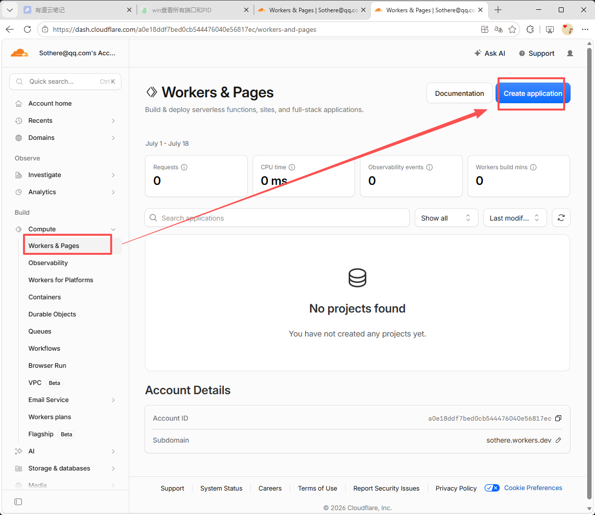
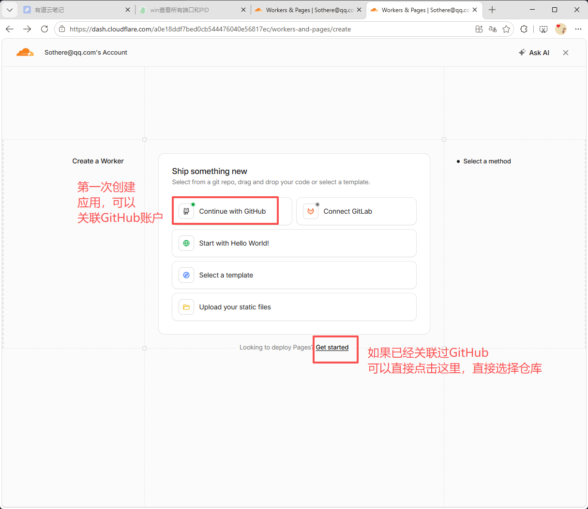
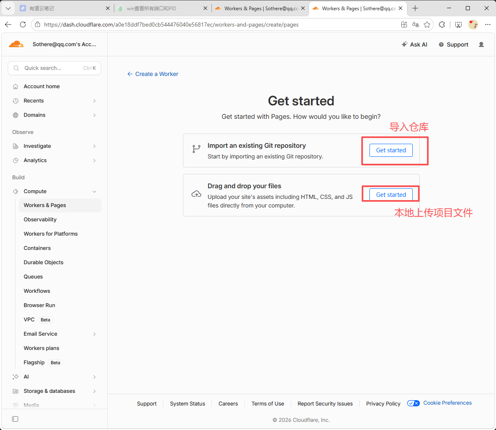
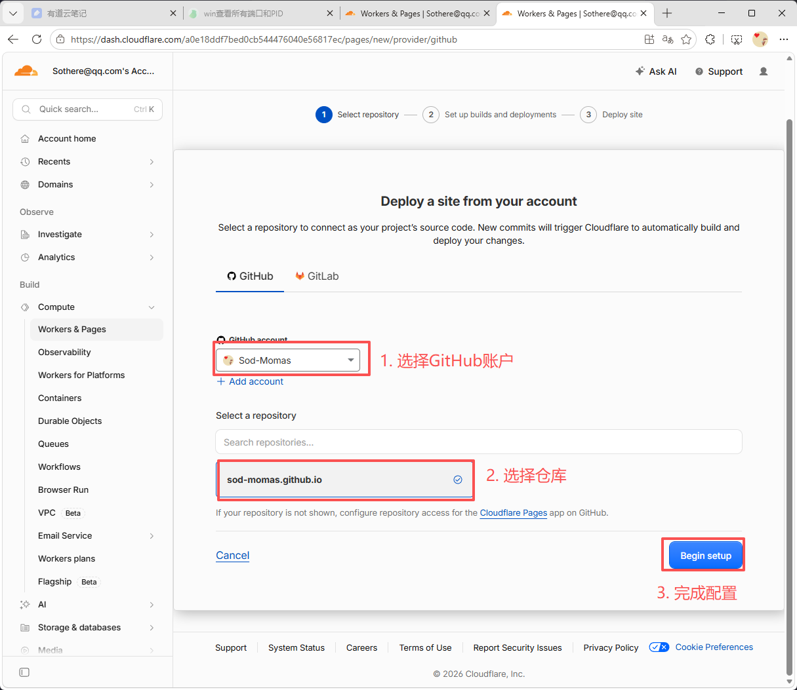
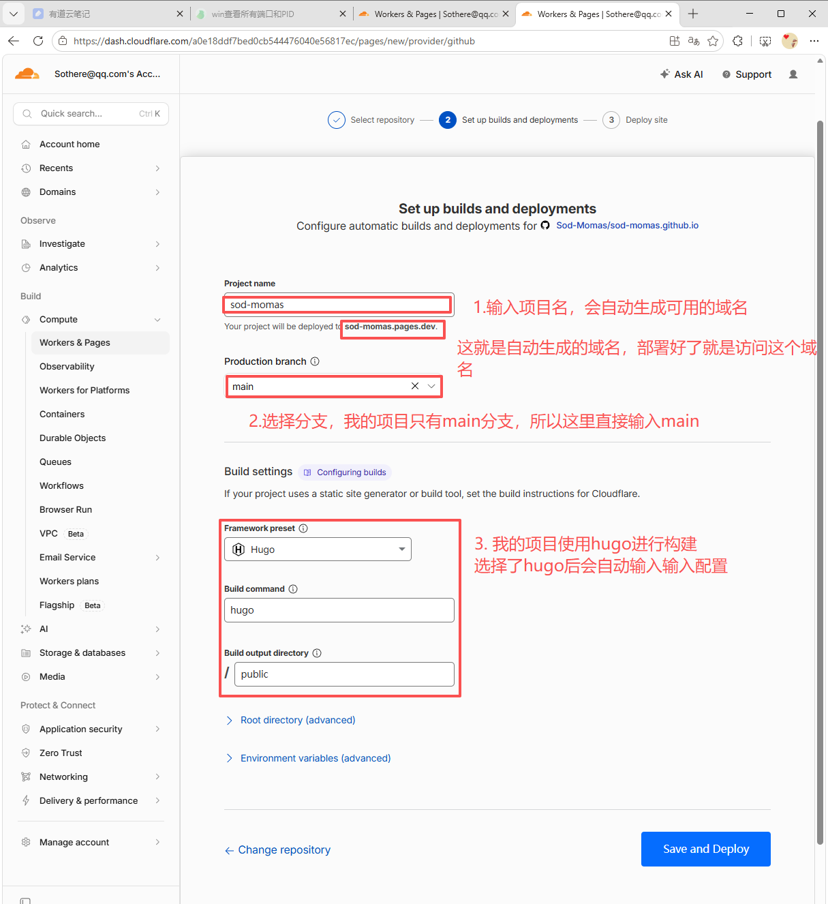
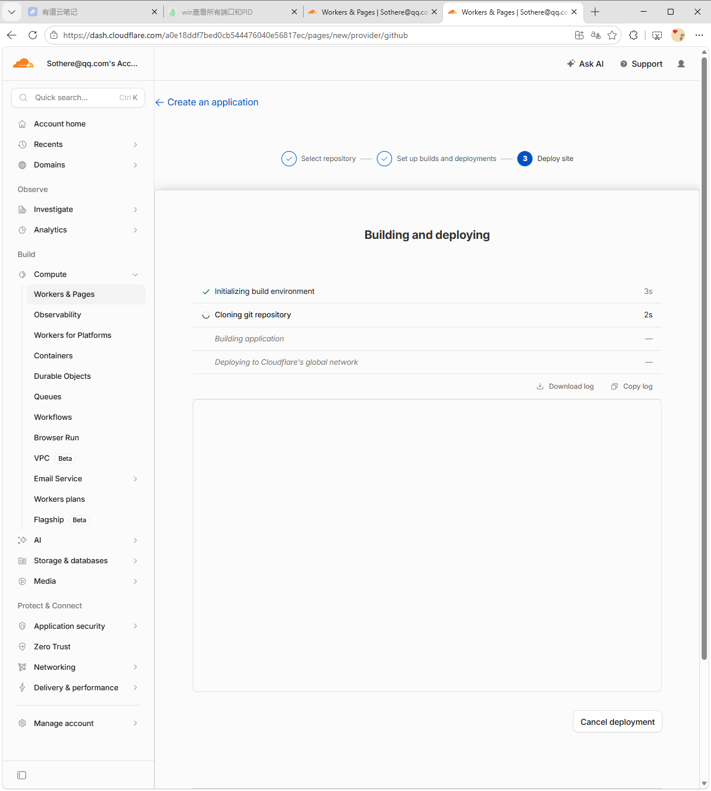
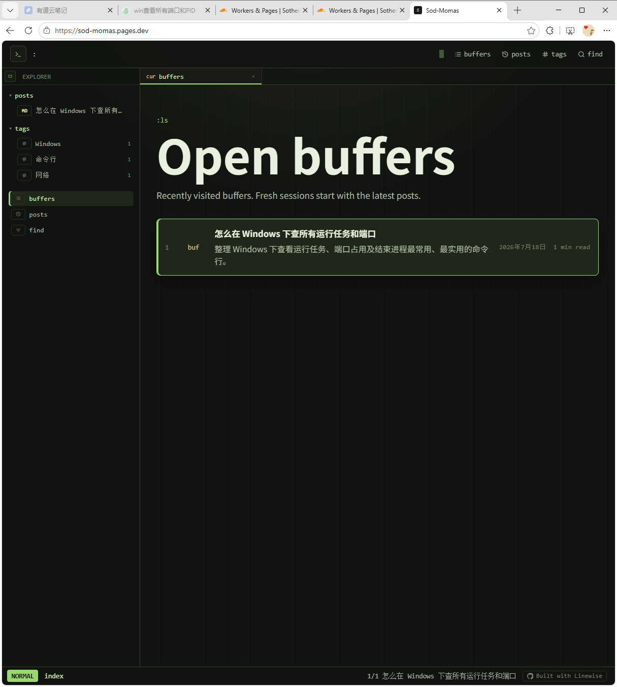

1. 先登录 [CloudFlare](https://www.cloudflare-cn.com/personal/)

2. 进入 `Workers & Pages` 管理页, 点击 `Create a Worker`

3. 关联 GitHub 账户, 然后进入部署配置页

4. 我们的项目托管在GitHub，所以选择 `Import an existing Git repository`

5. 选择账户和仓库，然后点击 `Begin setup`

6. 输入域名、选择分支、选择部署方式，然后点击 `Save and Deploy`

 

7. 它就会自动部署，部署完成后，就可以在浏览器访问了

8. 等待几分钟，就可以在浏览器访问了 https://sod-momas.pages.dev/ ，甚至自带https

